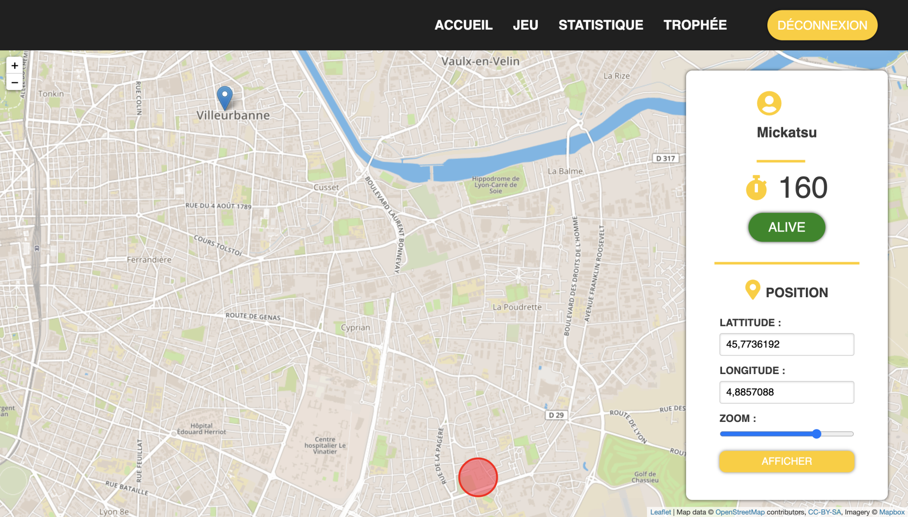

# M1IF13-2020

Ce dépôt contient les codes des TP de Web avancé et mobile pour 2019-2020.

## Description de l'application

L'application possède une partie admin, /admin qui permet de gérer les différents paramètres de la partie (ttl, position de la cible, création de la partie, et gestion des utilisateur).
Un système de connexion, en utilisant un serveur spring.
Un système de jeu, dont le but est d'attendire la cible.

## Organisation des fichiers

Le dossier /app dossier principal de l'application
Le dossier /simple-client et /TP1 concerne les premier TP de l'UE
Le dossier /users est le code pour la partie Spring.

## Installation

Installation des modules :
```
npm install
```

Lancement de la partie client dans app/client :
```
npm run server
```

Lancement de la partie serveur dans app/server :
```
node server.js
```

## Partie admin 

Visualisation de la target :



:warning: Pour créer une partie depuis la partie admin vous devez tous d'abord remplir et valider le formulaire pour créer la partie, avant de remplir et valider les formulaire pour modifier le ttl et la position de la target.

## Choix de l'utilisation de Scss pour le Responsive design à la place de Vuetify

Plusieurs arguments ont penché dans la balance pour nous pousser à faire ce choix, notamment grâce au avantage de travailler avec Sass : 

    - Nous avons un meilleur contrôle sur le visuel de notre application, ainsi que sur son affichage en vue responsive, car tout est codé à la main et donc bien mieux comprit
    - Le DOM en ressort très grandement allégé, là ou une bibliothèque de composant peut très vite l'alourdir de manière superflue
    - Le Sass permet d'avoir le style directement dans les composants, ce qui augmente leur possibilité de réutilisation, car on peut les utiliser dans d'autres projets sans aucun problème, là où une bibliothèque de composants demande un setup particulier
    - Notre stack actuel nous paraissait bien plus propice à l'utilisation de Sass, car il suffit d'ajouter un loader à notre webpack.config.js pour pouvoir l'utiliser à l'intérieur même des composants contrairement à une bibliothèque
    - Les feuilles de style sont plus précise et comportent moins de code inutilisé
    - Vuetify est un outil puissant et facilement utilisable si on construit notre application autour, ce qui n'est pas le cas ici, alors que le Sass peut évoluer plus facilement au fur et à mesure du projet, et s'intègre beaucoup plus facilement à un projet en cours

Les grands désavantage de l'utilisation de Sass sont la courbe d'apprentissage (Pour le css plus que le Sass en lui-même), de plus que du temps de programmation pur qui peut facilement être plus important qu'avec l'utilisation d'une bibliothèque de composant comme Vuetify, mais nous avons préféré tout de même cette méthode pour tous les avantages cités plus haut qu'elle nous apporte.

De plus, nous avons préalablement demandé l'autorisation pour éviter de prendre une décision contre le court du projet

